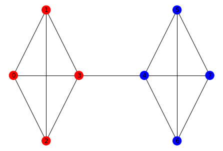

.. _dnx_algorithms:

==========
Algorithms
==========

Implementations of graph-theory algorithms on the D-Wave system and other
binary quadratic model samplers.

.. currentmodule:: dwave_networkx

.. _dnx_canonicalization:

Canonicalization
================

.. automodule:: dwave_networkx.algorithms.canonicalization

.. autosummary::
    :toctree: generated/

    canonical_chimera_labeling

.. _dnx_clique:

Clique
======

A clique in an undirected graph G = (V, E) is a subset of the vertex set such
that for every two vertices in C there exists an edge connecting the two.

.. figure:: ../_images/clique.png
    :name: Cover
    :alt: image
    :align: center
    :scale: 40 %

.. automodule:: dwave_networkx.algorithms.clique

.. autosummary::
    :toctree: generated/

    maximum_clique
    clique_number
    is_clique

.. _dnx_coloring:

Coloring
========

Graph coloring is the problem of assigning a color to the vertices of a graph in
a way that no adjacent vertices have the same color.

Example
-------

The map-coloring problem is to assign a color to each region of a map
(represented by a vertex on a graph) such that any two regions sharing a border
(represented by an edge of the graph) have different colors.

.. figure:: ../_images/Problem_MapColoring.png
    :name: Problem_MapColoringColoring
    :alt: image
    :align: center
    :scale: 70 %

    Coloring a map of Canada with four colors.

.. automodule:: dwave_networkx.algorithms.coloring

.. autosummary::
    :toctree: generated/

    is_vertex_coloring
    min_vertex_color
    min_vertex_color_qubo
    vertex_color
    vertex_color_qubo

.. _dnx_cover:

Cover
=====

Vertex covering is the problem of finding a set of vertices such that all the
edges of the graph are incident to at least one of the vertices in the set.

.. figure:: ../_images/Cover.png
    :name: CoverCover
    :alt: image
    :align: center
    :scale: 40 %

    Cover for a Chimera unit cell: the nodes of both the blue set of vertices
    (the horizontal tile of the Chimera unit cell) and the red set (vertical
    tile) connect to all 16 edges of the graph.

.. automodule:: dwave_networkx.algorithms.cover

.. autosummary::
    :toctree: generated/

    is_vertex_cover
    min_weighted_vertex_cover
    min_vertex_cover

.. _dnx_elimination_ordering:

Elimination Ordering
====================

Many algorithms for NP-hard problems are exponential in treewidth. However,
finding a lower bound on treewidth is in itself NP-complete. [Gog2004]_
describes a branch-and-bound algorithm for computing the treewidth of an
undirected graph by searching in the space of *perfect elimination ordering* of
vertices of the graph.

A *clique* of a graph is a fully-connected subset of vertices; that is, every
pair of vertices in the clique share an edge. A *simplicial* vertex is one
whose neighborhood induces a clique. A perfect elimination ordering is an
ordering of vertices :math:`1..n` such that any vertex :math:`i` is simplicial
for the subset of vertices :math:`i..n`.

.. automodule:: dwave_networkx.algorithms.elimination_ordering

.. autosummary::
    :toctree: generated/

    chimera_elimination_order
    elimination_order_width
    is_almost_simplicial
    is_simplicial
    max_cardinality_heuristic
    minor_min_width
    min_fill_heuristic
    min_width_heuristic
    pegasus_elimination_order
    treewidth_branch_and_bound

.. _dnx_markov:

Markov Networks
===============

.. automodule:: dwave_networkx.algorithms.markov

.. autosummary::
    :toctree: generated/

    sample_markov_network
    markov_network_bqm

.. _dnx_matching:

Matching
========

A matching is a subset of graph edges in which no vertex occurs more than once.

.. figure:: ../_images/Match.png
    :name: Matching
    :alt: image
    :align: center
    :scale: 40 %

    A matching for a Chimera unit cell: no vertex is incident to more than one
    edge in the set of blue edges

.. automodule:: dwave_networkx.algorithms.matching

.. autosummary::
    :toctree: generated/

    matching_bqm
    maximal_matching_bqm
    min_maximal_matching_bqm
    min_maximal_matching

.. _dnx_maximum_cut:

Maximum Cut
===========

A maximum cut is a subset of a graph's vertices such that the number of edges
between this subset and the remaining vertices is as large as possible.

.. figure:: ../_images/MaxCut.png
    :name: Cut
    :alt: image
    :align: center
    :scale: 60 %

    Maximum cut for a Chimera unit cell: the blue line around the subset of
    nodes {4, 5, 6, 7} cuts 16 edges; adding or removing a node decreases the
    number of edges between the two complementary subsets of the graph.

.. automodule:: dwave_networkx.algorithms.max_cut

.. autosummary::
    :toctree: generated/

    maximum_cut
    weighted_maximum_cut

.. _dnx_independent_set:

Independent Set
===============

An independent set is a set of a graph's vertices with no edge connecting any of
its member pairs.

.. figure:: ../_images/Cover.png
    :name: CoverIndependentSet
    :alt: image
    :align: center
    :scale: 40 %

    Independent sets for a Chimera unit cell: the nodes of both the blue set of
    vertices (the horizontal tile of the Chimera unit cell) and the red set
    (vertical tile) are independent sets of the graph, with no blue node
    adjacent to another blue node and likewise for red nodes.

.. automodule:: dwave_networkx.algorithms.independent_set

.. autosummary::
    :toctree: generated/

    maximum_weighted_independent_set
    maximum_independent_set
    is_independent_set

Helper Functions
----------------

.. autosummary::
    :toctree: generated/

    maximum_weighted_independent_set_qubo

.. _dnx_partitioning:

Partitioning
============

A `k`-partition consists of `k` disjoint and equally sized subsets of a graph's
vertices such that the total number of edges between nodes in distinct subsets
is as small as possible.

    A 2-partition for a simple graph: the nodes in blue are in the '0' subset,
    and the nodes in red are in the '1' subset. There are no other arrangements
    with fewer edges between two equally sized subsets.

.. automodule:: dwave_networkx.algorithms.partition

.. autosummary::
    :toctree: generated/

    partition

.. _dnx_social:

Social
======

A signed social network graph is a graph whose signed edges represent
friendly/hostile interactions between vertices.

.. figure:: ../_images/Social.png
    :name: Social
    :alt: image
    :align: center
    :scale: 80 %

    A signed social graph for three nodes, where Eve and Bob are friendly with
    each other and hostile to Alice. This network is balanced because it can be
    cleanly divided into two subsets, {Bob, Eve} and {Alice}, with friendly
    relations within each subset and only hostile relations between the subsets.

.. automodule:: dwave_networkx.algorithms.social

.. autosummary::
    :toctree: generated/

    structural_imbalance
    structural_imbalance_ising

.. _dnx_traveling_salesperson:

Traveling Salesperson
=====================

A traveling salesperson route is an ordering of the vertices in a complete
weighted graph.

.. figure:: ../_images/tsp.png
    :name: TSP_route
    :alt: image
    :align: center
    :scale: 80 %

    A traveling salesperson route of [2, 1, 0, 3].

.. automodule:: dwave_networkx.algorithms.tsp

.. autosummary::
    :toctree: generated/

    traveling_salesperson
    traveling_salesperson_qubo