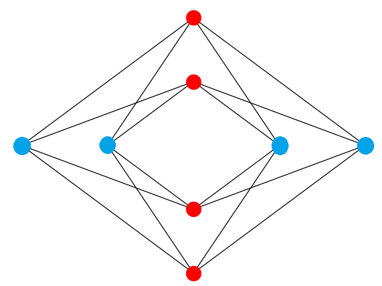

*****
Cover
*****

Vertex covering is the problem of finding a set of vertices such that all
the edges of the graph are incident to at least one of the vertices in the
set.

   Cover for a Chimera unit cell: the nodes of both the blue set of vertices
   (the horizontal tile of the Chimera unit cell) and the red set
   (vertical tile) connect to all 16 edges of the graph.

.. automodule:: dwave_networkx.algorithms.cover
.. autosummary::
   :toctree: generated/

   min_vertex_cover
   is_vertex_cover
