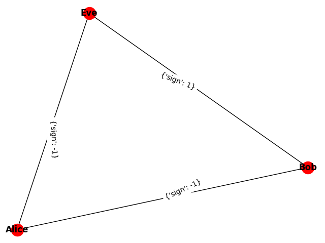

******
Social
******

A signed social network graph is a graph whose signed edges represent
friendly/hostile interactions between vertices.

   A signed social graph for three nodes, where Eve and Bob are friendly with 
   each other and hostile to Alice. This network is balanced because it can
   be cleanly divided into two subsets, {Bob, Eve} and {Alice}, with friendly
   relations within each subset and only hostile relations between the subsets.

.. automodule:: dwave_networkx.algorithms.social
.. autosummary::
   :toctree: generated/

    structural_imbalance
