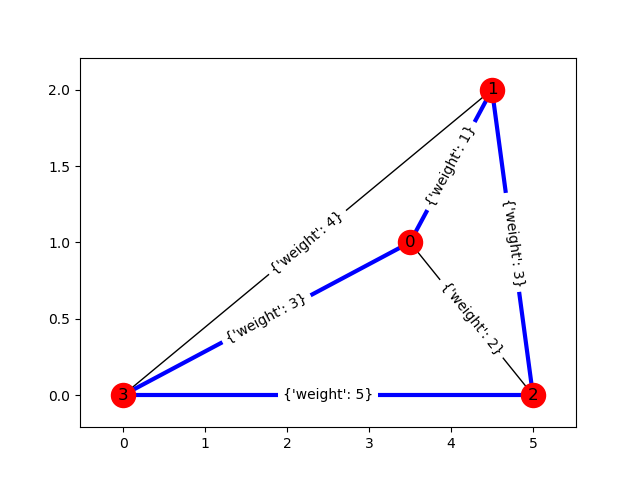

********
Traveling Salesman
********

A traveling salesman route is an ordering of the vertices in a complete weighted
graph.

   A traveling salesman route of [2, 1, 0, 3].

.. automodule:: dwave_networkx.algorithms.TSP
.. autosummary::
   :toctree: generated/

    traveling_salesman
