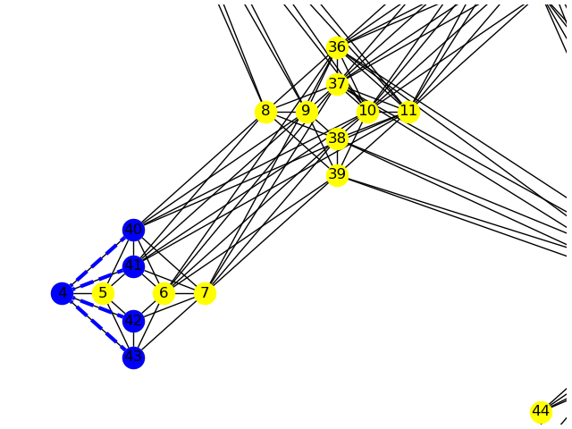
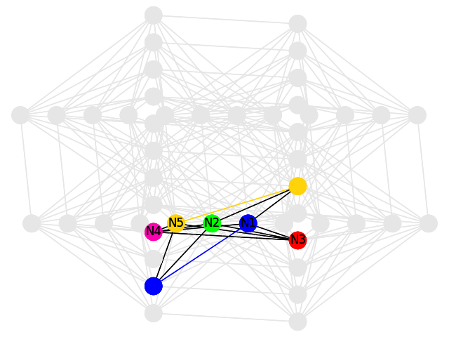

.. _dnx_drawing:

=======
Drawing
=======

Tools to visualize topologies of D-Wave QPUs and weighted :term:`graph` problems
on them.

.. currentmodule:: dwave_networkx

Chimera Graph Functions
=======================

.. automodule:: dwave_networkx.drawing.chimera_layout

.. autosummary::
   :toctree: generated/

   chimera_layout
   chimera_node_placer_2d
   draw_chimera
   draw_chimera_embedding
   draw_chimera_yield

Example
-------

This example uses the :func:`.chimera_layout()` function to show the positions
of nodes of a simple 5-node NetworkX graph in a Chimera lattice. It then uses the
:func:`.chimera_graph()` and :func:`.draw_chimera()` functions to display those
positions on a Chimera unit cell.

.. code-block:: python

   >>> import networkx as nx
   >>> import dwave_networkx as dnx
   >>> import matplotlib.pyplot as plt
   >>> H = nx.Graph()
   >>> H.add_nodes_from([0, 4, 5, 6, 7])
   >>> H.add_edges_from([(0, 4), (0, 5), (0, 6), (0, 7)])
   >>> pos=dnx.chimera_layout(H)
   >>> pos
   {0: array([ 0. , -0.5]),
    4: array([ 0.5,  0. ]),
    5: array([ 0.5 , -0.25]),
    6: array([ 0.5 , -0.75]),
    7: array([ 0.5, -1. ])}
   >>> # Show graph H on a Chimera unit cell
   >>> f, axes = plt.subplots(1, 1)
   >>> G=dnx.chimera_graph(1, 1, 4)  # Draw a Chimera unit cell
   >>> dnx.draw_chimera(G, node_color='r', ax=axes)
   >>> dnx.draw_chimera(H, node_color='b', node_shape='*', style='dashed', edge_color='b', width=3, ax=axes)
   >>> plt.show()
   >>> # matplotlib commands to add labels to graphic not shown

.. figure:: ../_images/chimera_layout_0-rightside.png
    :align: center
    :name: chimera_layout_0-rightside
    :scale: 60 %
    :alt: Graph H overlaid on a Chimera unit cell.

    Graph ``H`` (blue) overlaid on a Chimera unit cell (red nodes and black edges),
    which is rendered in a cross layout.

Pegasus Graph Functions
=======================

.. automodule:: dwave_networkx.drawing.pegasus_layout

.. autosummary::
   :toctree: generated/

   draw_pegasus
   draw_pegasus_embedding
   draw_pegasus_yield
   pegasus_layout
   pegasus_node_placer_2d

Example
-------

This example uses the :func:`.draw_pegasus()` function to show the positions
of nodes of a simple 5-node graph on a small Pegasus lattice.

.. code-block:: python

   >>> import dwave_networkx as dnx
   >>> import matplotlib.pyplot as plt
   >>> G = dnx.pegasus_graph(2)
   >>> H = dnx.pegasus_graph(2, node_list=[4, 40, 41, 42, 43],
                 edge_list=[(4, 40), (4, 41), (4, 42), (4, 43)])
   >>> # Show graph H on a small Pegasus lattice
   >>> f, axes = plt.subplots(1, 1)
   >>> dnx.draw_pegasus(G, with_labels=True, crosses=True, node_color="Yellow", ax=axes)
   >>> dnx.draw_pegasus(H, crosses=True, node_color='b', style='dashed',
             edge_color='b', width=3, ax=axes)
   >>> plt.show()

    Graph ``H`` (blue) overlaid on a small Pegasus lattice (yellow nodes and black edges),
    which is rendered in a cross layout.

Zephyr Graph Functions
======================

.. automodule:: dwave_networkx.drawing.zephyr_layout

.. autosummary::
   :toctree: generated/

   draw_zephyr
   draw_zephyr_embedding
   draw_zephyr_yield
   zephyr_layout
   zephyr_node_placer_2d

Example
-------

This example uses the :func:`.draw_zephyr_embedding` function to show the positions
of a five-node clique on a small Zephyr graph.

.. code-block:: python

   >>> import dwave_networkx as dnx
   >>> import matplotlib.pyplot as plt
   >>> import networkx as nx
   ...
   >>> G = dnx.zephyr_graph(1)
   >>> embedding = {"N1": [13, 44], "N2": [11], "N3": [41], "N4": [40], "N5": [9, 37]}
   ...
   >>> plt.ion()
   >>> dnx.draw_zephyr_embedding(G, embedding, show_labels=True)

    Five-node clique embedded in a small Zephyr graph.
