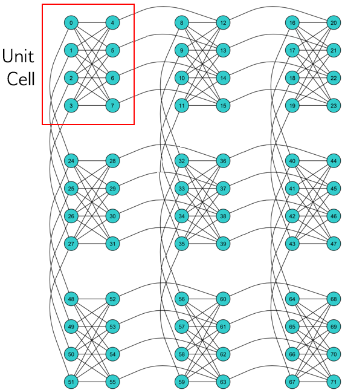

Introduction
============

For quantum computing, as for classical, the first step in
solving a problem is to express it in a mathematical formulation
compatible with the underlying physical hardware.

Native Formulations for D-Wave Systems
--------------------------------------

D-Wave systems solve problems that can be mapped onto an Ising model or a
quadratic unconstrained binary optimization (QUBO) problem.

.. math::

  \text{Ising:} \qquad
  E(\pmb{s}|\pmb{h},\pmb{J})
  = \left\{ \sum_{i=1}^N h_i s_i +
  \sum_{i<j}^N J_{i,j} s_i s_j  \right\}
  \qquad\qquad s_i\in\{-1,+1\}

is an objective function of :math:`N` variables :math:`\pmb s=[s_1,...,s_N]`
corresponding to physical Ising spins, where :math:`h_i` are the biases and
:math:`J_{i,j}` the couplings between spins.

.. math::

		\text{QUBO:} \qquad E(\pmb{x}| \pmb{Q})
    =  \sum_{i\le j}^N x_i Q_{i,j} x_j
    \qquad\qquad x_i\in \{0,1\}

is an objective function of :math:`N` binary variables represented as an
upper-diagonal matrix :math:`Q`, where diagonal terms are the linear coefficients and
the nonzero off-diagonal terms the quadratic coefficients.

Objective functions can be represented by graphs, a collection
of nodes (representing variables) and the connections between them (edges).

D-Wave Architecture: Chimera
----------------------------

To solve a QUBO or Ising objective function on the D-Wave system, you
must map it to a *Chimera* graph that represents architecture of the system's
qubits.

.. include::  ./drawing.rst
   :start-after: chimera-intro-start-marker
   :end-before: chimera-intro-end-marker

  A :math:`3 {\rm x} 3`  Chimera graph, denoted C3. Qubits are arranged in 9 unit cells.

D-Wave NetworkX
---------------

D-Wave NetworkX provides tools for working with Chimera graphs and
implementations of graph-theory algorithms on the D-Wave system and other binary
quadratic model samplers; for example, functions such as `draw_chimera()` provide
easy visualization for Chimera graphs; functions such as `maximum_cut()` or
`min_vertex_cover()` provide graph algorithms useful to optimization problems
that fit well with the D-Wave system.

Like the D-Wave system, all other supported samplers (a process that samples
from low energy states of the problem's objective function) must have
`sample_qubo` and `sample_ising` methods for solving Ising and QUBO models
and return an iterable of samples in order of increasing energy. You can set
a default sampler using the `set_default_sampler()` function.
